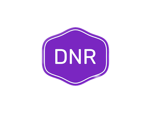

# DNR Emacs




<!-- markdown-toc start - Don't edit this section. Run M-x markdown-toc-refresh-toc -->

## Table of Contents

- [DNR Emacs](#dnr-emacs)
  - [Table of Contents](#table-of-contents)
  - [Features](#features)
  - [Prerequisite](#prerequisite)
    - [OS](#os)
    - [GNU Emacs](#gnu-emacs)
  - [Quick Start](#quick-start)
    - [Install](#install)
    - [Update](#update)
  - [Customization](#customization)
    - [Customize Group](#customize-group)
    - [Manual](#manual)
  - [Hydra](#hydra)
  - [Screenshots](#screenshots)
  - [FAQ](#faq)
  - [Donate](#donate)

<!-- markdown-toc end -->

GNU Emacs is an old pieace of software that has been of great use and benefit
for a lot of people. You can configure it as you wish, which is
advantageous if you feel attracted to the idea of molding this tool
to your needs, this is a disadvantage too, since you may eventually
spend too much time configuring Emacs instead of doing other important
things.

A few years ago, I found a nice PDF on internet, was the book Computational
Physics by Konstantinos Anagnostopoulos, and although the book is about
using C++ to solve problems in physics, it begins with an introduction to Emacs,
and that's how I ended it up loving and hating Emacs.

When we install Emacs for the first time, the GUI looks horrible, and
this is a feature not a bug, say the fans, because in Emacs you can change
everything. Now there are some starter kits like
[Doom Emacs](https://github.com/doomemacs/doomemacs)
[Spacemacs](https://www.spacemacs.org/)
[Danny Emacs](https://github.com/seagle0128/.emacs.d) and many more,
and it's a good idea starting with one of those, in fact, this
configuration is basically Danny Emacs adapted to my own use.


## Features

- Out of box.
- Clean and Fast.
- Quick fuzzy search.
- Better Org/Markdown support.
- Support multiple programming languages
  - C/C++/Object-C/C#/Java
  - Python/Ruby/Perl/PHP/Shell/Powershell/Bat
  - JavaScript/Typescript/JSON/YAML
  - HTML/CSS/XML
  - Golang/Swift/Rust/Dart/Elixir
  - ...
- Auto completion.
- Fly syntax check.
- Fly spell check.
- Git integration.
- Project/Workspace integration.
- Pomodor integration.
- MPD integration.
- Support docker.
- Better Chinese support:
  - Youdao dictionary
  - Google translation


## Prerequisite

### OS

- GNU Linux
- macOS
- Windows (Cygwin/MSYS)

### GNU Emacs

Please refer to [Installing Emacs](http://wikemacs.org/index.php/Installing_Emacs).

### Dotfiles

Recommend to use [Danny Dotfiles](https://github.com/seagle0128/dotfiles).

## Quick Start

### Install

```shell
mv ~/.emacs.d ~/.emacs.d.bak
git clone --depth 1 https://github.com/PlanetsFuture/DNR-EMACA ~/.emacs.d
```

Then start Emacs. Wait for a while to install packages at the first startup.


**Attention**: It may take long time to download packages at the first startup.
It's up to your network speed. If it takes too long time and no response, check
the connection or use proxy.

**Note**: Start Emacs with the minimal configuration for fast startup and
troubleshooting.

```shell
emacs -Q -l ~/.emacs.d/init-mini.el
```

### Update

```emacs-lisp
# Update Danny Emacs, including configurations and packages
M-x danny-update

# Update Emacs configurations only
M-x danny-update-config

# Update ~/.dotfiles if it exists
M-x danny-update-dotfiles

# Update packages only
M-x danny-update-packages

# Update all including configurations, packages and dotfiles
M-x danny-update-all
```

## Customization

### Customize Group

`M-x customize-group` and select `danny`. Set and save the configurations,
then restart Emacs.

### Manual

Add or change the configurations in `custom.el`, then restart Emacs.

For Example:

```emacs-lisp
(setq danny-logo nil)                        ; Logo file or nil (official logo)
(setq danny-full-name "user name")           ; User full name
(setq danny-mail-address "user@email.com")   ; Email address
(setq danny-proxy "127.0.0.1:1087")          ; HTTP/HTTPS proxy
(setq danny-socks-proxy "127.0.0.1:1086")    ; SOCKS proxy
(setq danny-server t)                        ; Enable `server-mode' or not: t or nil
(setq danny-icon t)                          ; Display icons or not: t or nil
(setq danny-package-archives 'melpa)         ; Package repo: melpa, emacs-cn, bfsu, netease, sjtu, tencent, tuna or ustc
(setq danny-theme 'auto)                     ; Color theme: auto, random, system, default, pro, dark, light, warm, cold, day or night
(setq danny-completion-style 'minibuffer)    ; Completion display style: minibuffer or childframe
(setq danny-dashboard nil)                   ; Display dashboard at startup or not: t or nil
(setq danny-restore-frame-geometry nil)      ; Restore the frame's geometry at startup: t or nil
(setq danny-lsp 'eglot)                      ; Set LSP client: lsp-mode, eglot or nil
(setq danny-lsp-format-disable-on-save t)    ; disable the on save formatting for all files
(setq danny-lsp-format-on-save-ignore-modes '(c-mode c++-mode python-mode markdown-mode)) ; Ignore format on save for some languages
(setq danny-tree-sitter t)                   ; Enable `tree-sitter' or not: t or nil
(setq danny-chinese-calendar nil)            ; Support Chinese calendar or not: t or nil
(setq danny-player t)                        ; Enable players or not: t or nil
(setq danny-prettify-symbols-alist nil)      ; Alist of symbol prettifications. Nil to use font supports ligatures.
(setq danny-prettify-org-symbols-alist nil)  ; Alist of symbol prettifications for `org-mode'
```

The default package archives is `melpa`. You can change it in `custom.el`, or
set manually via `M-x set-package-archives` anytime.

For the personal configurations, you could put to `~/.emacs.d/custom-post.org`
or`~/.emacs.d/custom-post.el`.

## Hydra

| Name                     | Scope                 | Keybinding        | Description                          |
| ------------------------ | --------------------- | ----------------- | ------------------------------------ |
| `toggles-hydra`          | global                | `<f6>`            | Global option toggles                |
| `window-hydra`           | global                | `C-c w`/`C-x o w` | Window management                    |
| `doom-modeline-hydra`    | doom-modeline-mode    | `C-<f6>`          | Mode-line options and actions        |
| `hydra-ivy`              | minibuffer, ivy-mode  | `C-o`             | Additional key bindings for Ivy      |
| `ivy-hydra-read-action`  | minibuffer, ivy-mode  | `M-o`             | Actions for`ivy-dispatching-done`    |
| `hydra-dired-qick-sort`  | dired                 | `S`               | Options for `dired-quick-sort`       |
| `org-hydra`              | org-mode              | `<`               | Org template                         |
| `dashboard-hydra`        | dashboard-mode        | `h`/`?`           | Actions for the dashboard            |
| `dumb-jump-hydra`        | global                | `C-M-j`           | Jump to definition                   |
| `ztreediff-hydra`        | zreediff-mode         | `C-<f5>`          | Actions for text mode directory tree |
| `git-messenger-hydra`    | global                | `C-x v p`         | Actions for `git-messenger`          |
| `smerge-mode-hydra`      | smerge-mode           | `C-c m`           | Actions for `smerge-mode`            |
| `rect-hydra`             | text-mode, prog-mode  | `C-<return>`      | Actions for Rectangle                |
| `rect-hydra`             | org-mode              | `S-<return>`      | Actions for Rectangle                |
| `hideshow-hydra`         | prog-mode             | `C-~`             | Actions for `hideshow`               |
| `lsp-ui-hydra`           | lsp-ui-mode           | `M-<f6>`          | Actions for `lsp-ui`                 |
| `dap-hydra`              | dap-mode              | `M-<f5>`          | Actions for `dap-debug`              |
| `elfeed-hydra`           | elfeed                | `?`               | Actions for RSS reader `elfeed`      |
| `xwidget-hydra`          | xwidget-webkit-mode   | `?`               | Actions for embedded webkit browser  |

Enjoy!
